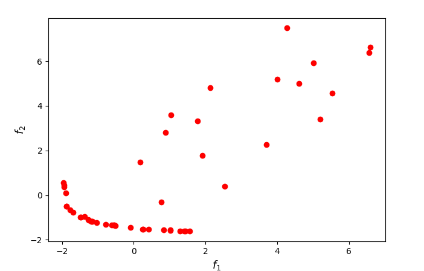
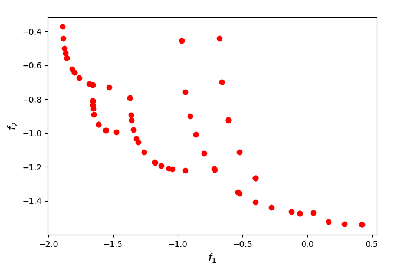

[](https://www.python.org/downloads/release/python-309/)
[](https://opensource.org/licenses/Apache-2.0)
[](https://zenodo.org/doi/10.5281/zenodo.10473320)

<p>
  
   
</p>

## Algorithms for Cardinality-Constrained Multi-Objective Optimization Problems

Implementation of the MOIHT/MOHyb algorithms and the SFSD methodology proposed in

[Lapucci, M. & Mansueto, P., Cardinality-Constrained Multi-Objective Optimization: Novel Optimality Conditions and Algorithms. Journal of Optimization Theory and Applications (2024)](
https://doi.org/10.1007/s10957-024-02397-3)

and of the MOSPD algorithm introduced in 

[Lapucci, M., A penalty decomposition approach for multi-objective cardinality-constrained optimization problems. Optimization Methods and Software (2022).](
https://doi.org/10.1080/10556788.2022.2060972)

If you have used our code for research purposes, please cite the publications mentioned above.
For the sake of simplicity, we provide the Bibtex format:

```
@article{Lapucci2024,
         author={Lapucci, Matteo and Mansueto, Pierluigi},
         title={Cardinality-Constrained Multi-objective Optimization: Novel Optimality Conditions and Algorithms},
         journal={Journal of Optimization Theory and Applications},
         year={2024},
         month={Mar},
         day={04},
         issn={1573-2878},
         doi={10.1007/s10957-024-02397-3},
         url={https://doi.org/10.1007/s10957-024-02397-3}
}

@article{lapucci_penaltydecomposition_2022,
         author = {Matteo Lapucci},
         title = {A penalty decomposition approach for multi-objective cardinality-constrained optimization problems},
         journal = {Optimization Methods and Software},
         volume = {37},
         number = {6},
         pages = {2157-2189},
         year = {2022},
         publisher = {Taylor & Francis},
         doi = {10.1080/10556788.2022.2060972}
}

```

### Main Dependencies Installation

In order to execute the code, you need an [Anaconda](https://www.anaconda.com/) environment and the Python package [nsma](https://pypi.org/project/nsma/) installed in it. For a detailed documentation of this framework, we refer the reader to its [GitHub repository](https://github.com/pierlumanzu/nsma).

For the package installation, open a terminal (Anaconda Prompt for Windows users) in the project root folder and execute the following command. Note that a Python version 3.9 or higher is required.

```
pip install nsma
```

##### Gurobi Optimizer

In order to run some parts of the code, the [Gurobi](https://www.gurobi.com/) Optimizer (Version 9 or higher) needs to be installed and, in addition, a valid Gurobi licence is required. The code was experimented with the Gurobi-related library ```gurobipy v9.5.2```.

### Usage

In ```parser_management.py``` you can find all the possible arguments. Given a terminal (Anaconda Prompt for Windows users), an example of execution could be the following.

```python main.py --single_point_methods MOIHT --refiner SFSD --prob_type QP --prob_path test_QPs/QP_n25_k1_a.pkl --s 5 --max_time 2 --plot_pareto_front --general_export```

### Contact

If you have any question, feel free to contact me:

[Pierluigi Mansueto](https://webgol.dinfo.unifi.it/pierluigi-mansueto/)<br>
Global Optimization Laboratory ([GOL](https://webgol.dinfo.unifi.it/))<br>
University of Florence<br>
Email: pierluigi dot mansueto at unifi dot it
